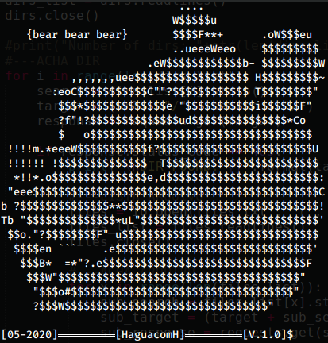
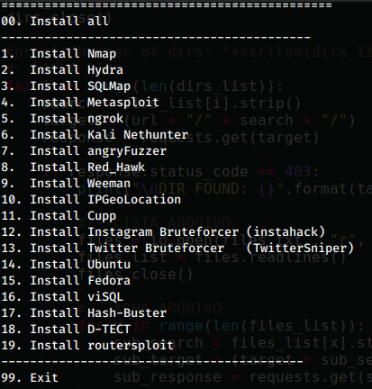

# b3x - bear bear bear

Python script to automate tool installations in Termux

> Easy... 



## Instalação

In terminal type:

```sh
git clone https://github.com/joaroque/b3x.git
```
```sh
python3 b3x.py
```
## Screenshots

* __Menu__


